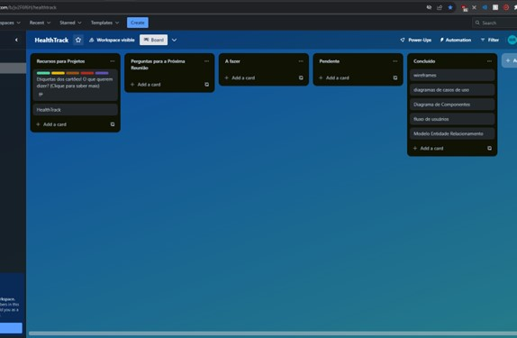

# Metodologia

A metodologia contempla as definições de ferramental utilizado pela equipe tanto para a manutenção dos códigos e demais artefatos quanto para a organização do time na execução das tarefas do projeto.

## Relação de Ambientes de Trabalho

| Ambiente                          | Plataforma   | Link de Acesso                                           | Repositório de código fonte                                   |
|-----------------------------------|--------------|----------------------------------------------------------|-------------------------------------------------------------|
|Repositório de código fonte | GitHub | [https://github.com/rommelcarneiro/tiaw-template](https://github.com/rommelcarneiro/tiaw-template)               |                                                             |
| Documentos do projeto             | Google Drive  | [https://docs.google.com/folder/d/1xE9t6zD78VnVkeOSgDfss33QWe85ogqYpx9x-tuG24](https://docs.google.com/folder/d/1xE9t6zD78VnVkeOSgDfss33QWe85ogqYpx9x-tuG24) |
| Projeto de Interface e Wireframes | Figma      | [https://marvelapp.com/4hd6091](https://www.figma.com/file/Dkm3RSgXVspR0ycz9iCs38/Untitled?type=design&node-id=0%3A1&mode=design&t=SzVC52cqBljlR9bB-1) |                                                             |
| Gerenciamento do Projeto          | Trello       | [https://trello.com/b/LupglzUz/tiaw-template](https://trello.com/b/jv2F6f6H/healthtrack)                       |                                                             |

### Divisão de Papéis

A equipe utiliza metodologias ágeis, tendo escolhido o Scrum como base para definição do
processo de desenvolvimento.
A equipe está organizada da seguinte maneira:
● Scrum Master: Bernardo Jeunon de Alencar
● Product Owner: Márcio Emanuel Batista de Pádua
● Equipe de Desenvolvimento: Davidson Marques, Willian Ribeiro, César Pereira dos Santos Filho
● Equipe de Design: Caique Romero Magalhães

### Processo

## Quadro Kanban - HealthTrack

O quadro Kanban do grupo no Trello é utilizado para organizar e distribuir tarefas do projeto. A estrutura é baseada na proposta de Littlefield (2016).

### Listas:

1. **Pergunta para próxima reunião:**
   - Serve para anexar perguntas e dúvidas para a próxima reunião.

2. **A fazer:**
   - Representa o Sprint Backlog atual em que a equipe está trabalhando.

3. **Em Andamento:**
   - Tarefas que foram iniciadas são movidas para esta lista.

4. **Teste:**
   - Checagem de Qualidade. As tarefas concluídas são movidas para esta lista para revisão no final da semana.

5. **Concluído:**
   - Tarefas que passaram pelos testes e controle de qualidade, prontas para serem entregues ao usuário.

### Quadro Kanban URL:

Figura X: (Inserir imagem do quadro no estado atual)

## Categorias de Tarefas

A tarefas são, ainda, etiquetadas em função da natureza da atividade e seguem o seguinte esquema de cores/categorias:

- **Documentação:** Verde
- **Desenvolvimento:** Amarelo
- **Infraestrutura:** Laranja
- **Testes:** Vermelho
- **Gerência de Projetos:** Roxo
