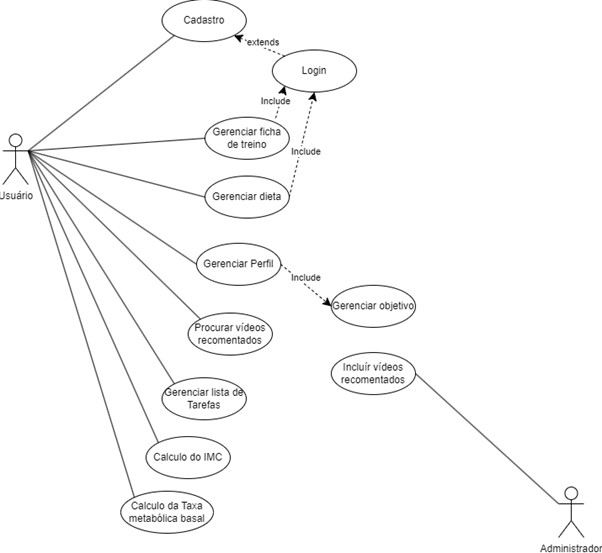

# Arquitetura da Solução

[Projeto de Interface](https://github.com/ICEI-PUC-Minas-PMV-ADS/pmv-ads-2023-2-e2-proj-int-t7-healthtrack/blob/main/docs/04-Projeto%20de%20Interface.md)

Definição de como o software é estruturado em termos dos componentes que fazem parte da solução e do ambiente de hospedagem da aplicação.

## Diagramas de Casos de Uso

## Diagrama de componentes

Diagrama que permite a modelagem física de um sistema, através da visão dos seus componentes e relacionamentos entre os mesmos.

Exemplo: 

Os componentes que fazem parte da solução são apresentados na Figura XX.

Figura XX - Arquitetura da Solução

A solução implementada conta com os seguintes módulos:
- **Navegador** - Interface básica do sistema  
  - **Páginas Web** - Conjunto de arquivos HTML, CSS, JavaScript e imagens que implementam as funcionalidades do sistema.
   - **Local Storage** - armazenamento mantido no Navegador, onde são implementados bancos de dados baseados em JSON. São eles: 
     - **Ficha de Treino** -  Uma lista que serve de guia para uma rotina de treino específica 
     - **Dietas** - dietas adicionadas pelo usuário
     - **Exercícios** - exercícios adicionadas pelo usuário
     - **Receitas** - receitas adicionadas pelo usuário
     - **Tarefas** - Lista de afazeres descrita  pelo usuário
     - **Vídeoa** -  Lista de vídeos para o usuário se inspirar 
 - **Hospedagem** - local na Internet onde as páginas são mantidas e acessadas pelo navegador. 

## Diagrama de Classes
Modelo Entidade Relacionamento

## Tecnologias Utilizadas

A aplicação que estamos prestes a desenvolver será construída utilizando C# como linguagem principal, aproveitando as capacidades do ASP.NET Core MVC para a construção da interface web. No núcleo do acesso aos dados, estaremos utilizando o Entity Framework, permitindo uma interação simplificada com um banco de dados relacional. Para armazenar e recuperar dados, optamos pelo SQL Server. Todo esse desenvolvimento será realizado no ambiente integrado e robusto oferecido pelo Visual Studio Community, que facilita o ciclo de vida completo do desenvolvimento, desde a codificação até a depuração e design da interface.

## Hospedagem

Explique como a hospedagem e o lançamento da plataforma foi feita.
