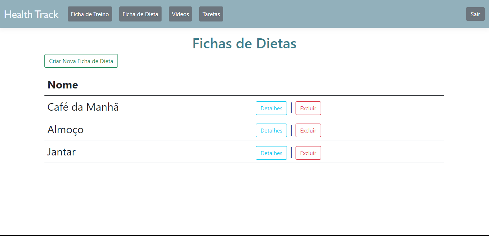
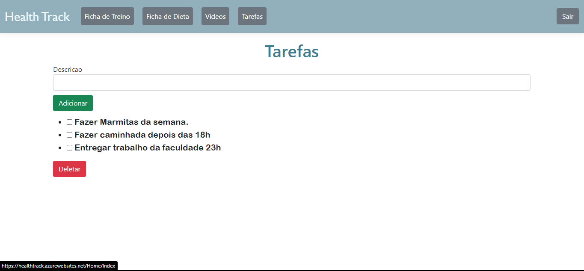

# Template padrão do site

O padrão de layout a ser utilizado pelo site tem correspondência ao projeto de Interface elaborado anteriormente, conforme Figura X.

 
Figura X - Template padrão do site

# Template do Site

O padrão de layout a ser utilizado pelo site tem correspondência ao projeto de Interface elaborado anteriormente, conforme Figura X.

Figura X - Template padrão do site

O template criado está disponível no [site do GitHub](http://github.com/…..) e é composto pelos seguintes layouts:

- Tela login
- Tela de Cadastro
- Home
- Academy
- Tarefa
- Profile

A responsividade segue o padrão do Display Flex.

## Home
Tela que abrange a visualização da Ficha de Treino e Dietas, onde pode adicionar conforme a necessidade do usuário final.

## Tela de Vídeos
Este layout é utilizado para exibição de vídeos de treinos e dietas para auxiliar o usuário.

## Tarefas
Local onde são feitas a Lista de afazeres diária do usuário.

## Profile
Local onde obtém as informações do usuário, idade, peso e altura. Além de fornecer o cálculo da Taxa metabólica basal e IMC.

