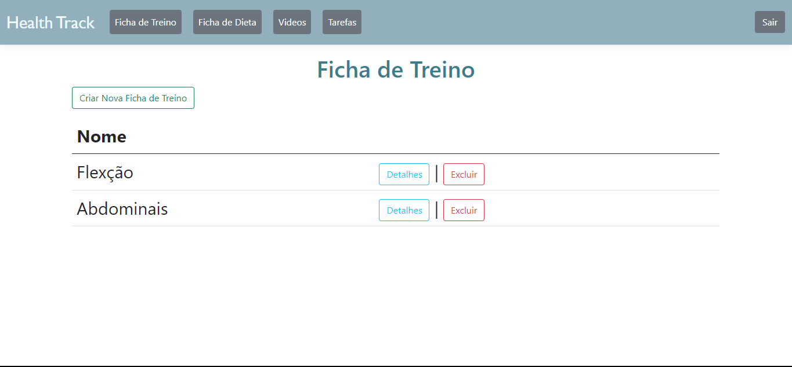

# Funcionalidades do Sistema (Telas)

Nesta seção, são apresentadas as telas desenvolvidas para cada uma das funcionalidades do sistema. O respectivo endereço (URL) e outras orientações de acesso são apresentadas na sequência.

## Criação de Ficha de Exercícios e Dietas (RF-01 e RF-02)
A tela principal do sistema apresenta dois boards com a função de criar sua ficha de treino e montar sua dieta.





### Requisitos atendidos
- RF-01: O site deve apresentar, na página principal, um board para cadastro de exercício físico do usuário.
- RF-02: O site deve apresentar, na página principal, um board para cadastro de dieta do usuário.

### Artefatos da funcionalidade
- homepage.html
- homepageScript.js
- homepageStyle.css

## Tela de Vídeos (RF-07)


A tela de Academy permite ao usuário assistir vídeos sobre treinos e dietas.

### Artefatos da Funcionalidade
- Academy.html
- academyScript.js
- academyStyle.css

### Estrutura de Dados
```json
{
	"Treinos": [
		{
			"id": 1,
			"Exercício": "50 min - Esteira"
		}
	]
}

